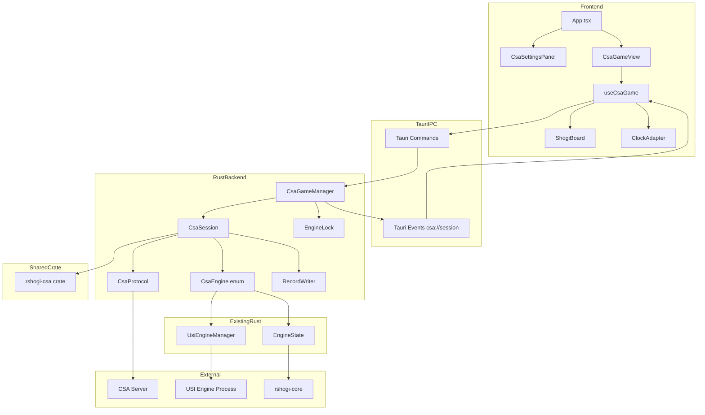
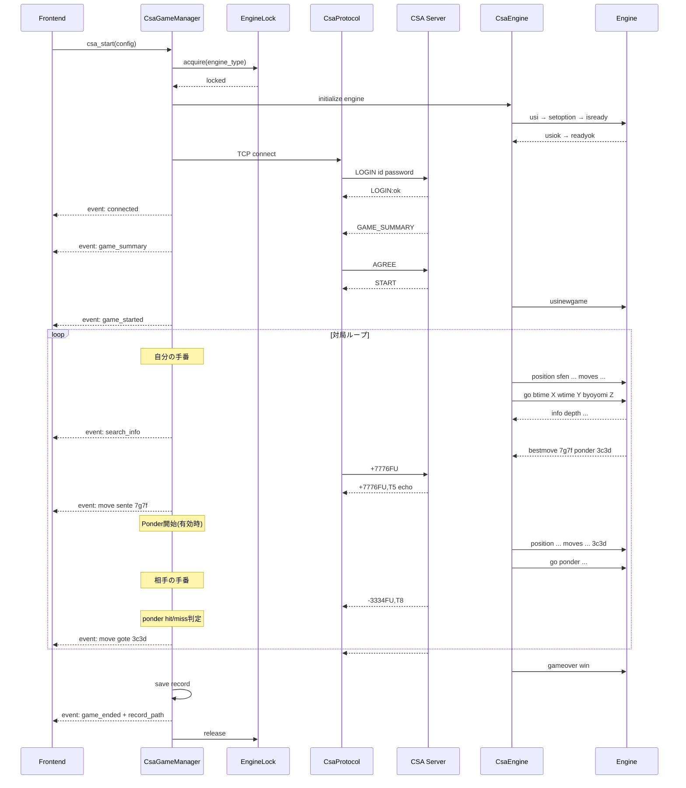
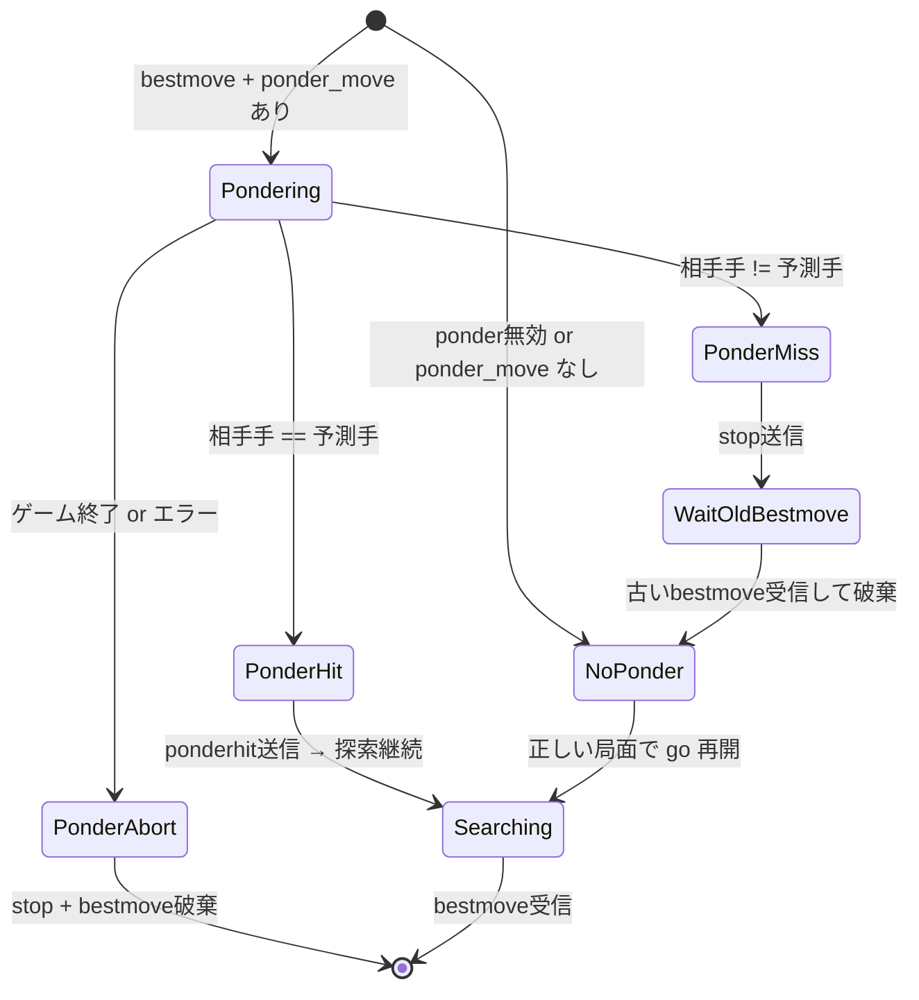
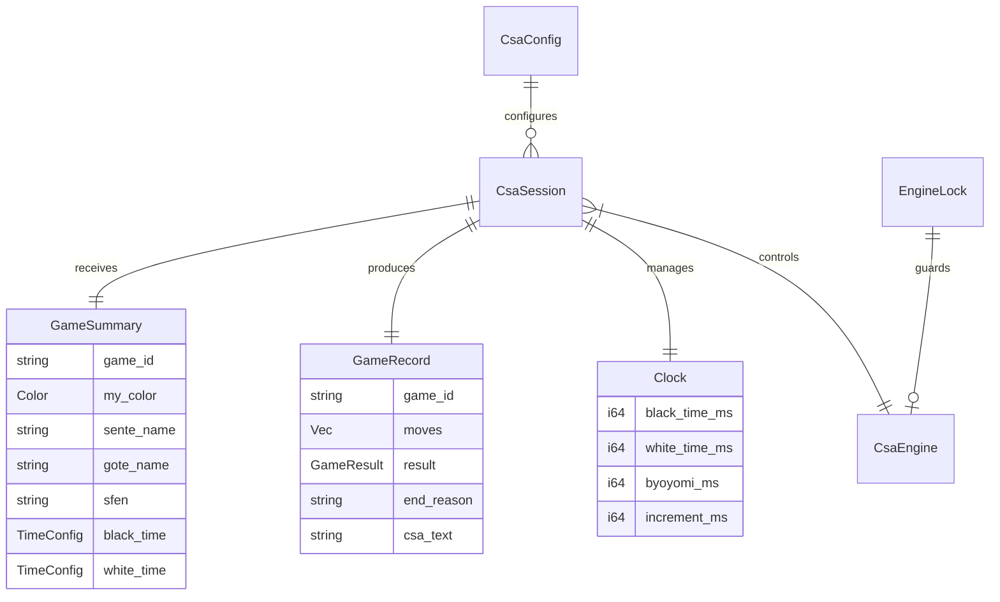

# Design Document: csa-protocol-game

## Overview

**Purpose**: デスクトップアプリからCSAサーバー（floodgate等）に直接TCP接続し、内蔵エンジンまたは外部USIエンジンを使って自動対局する機能を提供する。

**Users**: エンジン開発者・将棋AI愛好者が、エンジンをfloodgate等のCSAサーバーに接続して対局・評価するために使用する。

**Impact**: 既存のローカル対局・解析機能に加え、ネットワーク対局モードを新設。CSA対局中は使用エンジンを専有し、通常のエンジン解析を排他制御する。

### Goals
- CSAプロトコル準拠のサーバー接続・対局・終了フローを実装
- 内蔵エンジン（rshogi-core）と外部USIエンジンの両方でCSA対局可能にする
- ponder対応を含む時間管理を正確に行い、floodgate対局で実用可能な品質を達成
- Floodgate拡張（評価値コメント）に対応
- GUIから接続設定・対局制御を行える直感的なUIを提供

### Non-Goals
- CSAサーバーの実装やホスティング
- 対局中の手動指し手入力（エンジン自動対局のみ）
- Web版への展開（デスクトップ専用、TCPソケット必須）

## Architecture

### Existing Architecture Analysis

現在のデスクトップアプリは以下の2系統でエンジンを管理している:
- **内蔵エンジン**: `EngineState`（グローバルMutex）→ rshogi-core → 検索スレッド
- **外部USI**: `UsiEngineManager`（セッションHashMap）→ tokioサブプロセス → イベント送出

CSA対局はこれらの既存エンジン管理を **再利用** しつつ、CSA固有の制御（usinewgame, gameover, ponderhit, btime/wtime付きgo）を追加する。`CsaEngine` enumで内蔵/外部USIを抽象化し、CsaSession から統一的に制御する。

ponder状態遷移（ponderhit / stop+wait_bestmove）はサーバーイベントとの同時待ちが必要なため、エンジン制御はRust側で完結させる。TS `EngineClient` インターフェースは使用しない（詳細は `research.md` 参照）。

### Architecture Pattern & Boundary Map



**Architecture Integration**:
- **選択パターン**: CSAセッション完全Rust管理 — TCP接続とエンジン制御を同一非同期タスクで統合
- **既存コード再利用**: `usi_engine.rs` のユーティリティ関数（`parse_bestmove`, `parse_info` は既にpub。`send_line`, `create_engine_command` は `pub(crate)` 化が必要）を活用。新規の EngineDriver は作成しない
- **エンジン抽象化**: `CsaEngine` enumで内蔵（`EngineState`）と外部USI（自前プロセス起動、既存 `UsiEngineSession` とは別インスタンス）を型付きAPIで統一
- **排他制御**: `EngineLock` でCSA対局中のエンジン専有を管理し、通常解析との競合を防止
- **CSA変換**: `rshogi-csa` 共有crateでCSA⇔USI変換を提供（rshogi-ossから切り出し、本プロジェクトの作業スコープ内）

### Technology Stack

| Layer | Choice / Version | Role in Feature | Notes |
|-------|------------------|-----------------|-------|
| Frontend | React 19, TypeScript | CSA設定UI、対局表示 | 既存コンポーネント再利用 |
| Backend | Tauri 2, Rust | CSAプロトコル、セッション管理、エンジン制御 | tokio非同期 |
| Networking | tokio::net::TcpStream | CSAサーバーTCP接続 | Cargo.toml に tokio features `net`, `macros`, `sync` 追加が必要（`sync` は現在 tauri 経由で間接有効だが明示化すべき） |
| TCP Options | tokio set_nodelay + socket2 | TCP_NODELAY / SO_KEEPALIVE | TCP_NODELAY は `TcpStream::set_nodelay()` で対応。SO_KEEPALIVE は `socket2` crate 追加が必要（`Cargo.toml` に追加） |
| Error | thiserror crate | CsaError 型の derive | `Cargo.toml` に追加が必要 |
| Storage | tauri-plugin-store | 接続設定の永続化 | 既存パターン踏襲 |
| CSA変換 | rshogi-csa crate (新設) | CSA⇔USI指し手変換、局面パース | rshogi-ossから `common/csa.rs` を切り出し。本プロジェクトの作業スコープ |

## System Flows

### CSA対局全体フロー



**Key Decisions**:
- エンジン初期化 + EngineLock取得はTCP接続前に完了させる（初期化失敗時にサーバーを巻き込まない）
- サーバーエコーの `,T<秒>` から消費時間をパースし、Clock に反映してUIに送信
- `tokio::select!` でサーバーRxとエンジンRxを同時待ち
- イベント送出は `app.emit()`（既存USIエンジンのパターンに合わせる）

### Ponder状態遷移



## Requirements Traceability

| Requirement | Summary | Components | Interfaces | Flows |
|-------------|---------|------------|------------|-------|
| 1.1-1.6 | CSAサーバー接続・認証 | CsaProtocol | csa_start, csa_stop | 全体フロー: LOGIN |
| 2.1-2.4 | 対局マッチング・開始 | CsaProtocol, CsaSession | CsaSessionEvent | 全体フロー: GAME_SUMMARY→START |
| 3.1-3.8 | 対局進行 | CsaSession, CsaEngine | CsaSessionEvent | 対局ループ |
| 4.1-4.7 | 時間管理 | CsaSession (Clock) | CsaSessionEvent | 対局ループ: go引数 |
| 5.1-5.4 | Ponder対応 | CsaSession, CsaEngine | — | Ponder状態遷移 |
| 6.1-6.7 | 対局終了・結果処理 | CsaSession, CsaProtocol | CsaSessionEvent | 全体フロー: 終局 |
| 7.1-7.5 | 棋譜記録 | RecordWriter, CsaGameManager | CsaSessionEvent (GameEnded) | 終局後: 保存 + UIリスト追加 |
| 8.1-8.3 | Floodgate拡張 | CsaSession | — | 対局ループ: コメント付与 |
| 9.1-9.8 | 接続設定UI | CsaSettingsPanel | csa_save_config, csa_load_config | — |
| 10.1-10.6 | 対局中UI | CsaGameView, ClockAdapter | CsaSessionEvent | — |
| 11.1-11.4 | エラー・再接続 | CsaGameManager | CsaSessionEvent | エラーリカバリ |
| 12.1-12.4 | エンジンライフサイクル | CsaEngine, EngineLock | — | 全体フロー: 初期化/終了 |

## Components and Interfaces

| Component | Domain/Layer | Intent | Req Coverage | Key Dependencies | Contracts |
|-----------|-------------|--------|--------------|------------------|-----------|
| CsaGameManager | Rust/Backend | CSAセッションのライフサイクル・排他・イベント中継 | 1, 2, 11, 12 | CsaSession(P0), EngineLock(P0), AppHandle(P0) | Service, Event, State |
| CsaProtocol | Rust/Backend | CSAサーバーとのTCP通信 | 1, 2, 6 | tokio::net(P0) | Service |
| CsaSession | Rust/Backend | 対局ゲームループ、ponder、時計 | 3, 4, 5, 6, 8 | CsaEngine(P0), CsaProtocol(P0), rshogi-csa(P0) | Service, State |
| CsaEngine | Rust/Backend | 内蔵/外部USIエンジンの統一抽象 | 3, 5, 12 | UsiEngineManager(P0), EngineState(P0) | Service |
| EngineLock | Rust/Backend | CSA対局中のエンジン専有管理 | 12 | — | State |
| RecordWriter | Rust/Backend | 棋譜の生成と保存 | 7 | rshogi-csa(P1), tokio::fs(P1) | Service |
| CsaSettingsPanel | TS/UI | CSA接続設定画面 | 9 | Tauri Store(P0) | State |
| CsaGameView | TS/UI | CSA対局表示・制御 | 10 | ShogiBoard(P0), ClockAdapter(P0) | Event |
| ClockAdapter | TS/UI | CSA時計データ → 既存ClockDisplay props変換 | 10 | ClockDisplay(P0) | — |
| useCsaGame | TS/Hook | Tauri IPC → React状態変換 | 10, 11 | Tauri listen/invoke(P0) | Event, State |

### Rust Backend Layer

#### CsaGameManager

| Field | Detail |
|-------|--------|
| Intent | CSAセッションの開始・停止・排他制御・イベント中継を管理する |
| Requirements | 1.1-1.6, 2.1-2.4, 11.1-11.4, 12.1-12.4 |

**Responsibilities & Constraints**
- CSAセッション（接続→対局→切断）の全ライフサイクルを所有
- 同時に1つのCSAセッションのみ実行可能
- EngineLock を取得し、CSA対局中は通常のエンジン操作を排他
- セッション内のイベントを `app.emit()` でフロントエンドに中継
- 連続対局モードの制御（max_games, 対局間の再接続）
- 連続対局間ではエンジンを維持（`usinewgame` で状態リセット）。エラー時のみエンジン再初期化

**Dependencies**
- Inbound: Tauri commands — フロントエンドからの開始/停止指示 (P0)
- Outbound: CsaSession — 対局実行の委譲 (P0)
- Outbound: Tauri AppHandle — `app.emit()` でイベント送出 (P0)
- Outbound: EngineLock — エンジン専有の取得/解放 (P0)
- External: tauri-plugin-store — 設定の永続化 (P1)

**Contracts**: Service [x] / Event [x] / State [x]

##### Service Interface
```rust
// Tauri commands（apps/desktop/src-tauri/src/csa_game.rs に配置）
#[tauri::command]
async fn csa_start(config: CsaConfig, app: AppHandle, manager: State<'_, CsaGameManager>, engine_lock: State<'_, EngineLock>) -> Result<(), String>;

#[tauri::command]
async fn csa_stop(manager: State<'_, CsaGameManager>) -> Result<(), String>;

#[tauri::command]
async fn csa_save_config(app: AppHandle, config: CsaConfig) -> Result<(), String>;

#[tauri::command]
async fn csa_load_config(app: AppHandle) -> Result<Option<CsaConfig>, String>;
```

##### Event Contract
- Published: `CsaSessionEvent` on channel `"csa://session"`
- Delivery: `app.emit("csa://session", &event)` → フロントエンドで `listen`
- Ordering: セッション内で発生順序を保証（単一tokioタスクから送出）

##### State Management
```rust
struct CsaGameManager {
    session_handle: Mutex<Option<tokio::task::JoinHandle<()>>>,
    cancel_token: tokio_util::sync::CancellationToken,
}
```
- 排他: `session_handle` が `Some` なら実行中、`csa_start` は拒否
- 停止: `cancel_token.cancel()` を呼び出し。セッション内では `tokio::select!` のブランチとして `cancel_token.cancelled()` を監視（`AtomicBool` ではなく `CancellationToken` を使用。`Future` を実装しているため `select!` と直接統合可能）
- `tokio-util` crate の追加が必要（`Cargo.toml` に `tokio-util = { version = "0.7", features = ["rt"] }`）

**Implementation Notes**
- 連続対局時の指数バックオフ: 初回10秒、最大15分、成功でリセット。サーバーエラー時はTCPのみ再接続（エンジン維持）、エンジンエラー時はエンジンも再初期化
- `csa_stop` は対局中なら `%TORYO` 送信を試みてからLOGOUT
- **所有権モデル**: `CsaGameManager` が `Option<CsaEngine>` を所有。対局ループでは `CsaSession` に `&mut CsaEngine` を貸し出し。連続対局間はエンジンを維持（`new_game()` でリセット）。セッション終了時に `.take()` → `shutdown()` を呼ぶ
- ファイル配置: `apps/desktop/src-tauri/src/csa_game.rs` を新設し、`lib.rs` の `generate_handler![]` に登録
- **Tauri State の所有権**: `EngineState` と `EngineLock` は `.manage(Arc::new(...))` で登録し、`State<'_, Arc<EngineState>>` として受け取る。`Arc::clone()` で tokio タスクに move 可能にする。既存の `EngineState` 管理コードも `.manage(Arc::new(EngineState::default()))` パターンに移行が必要

---

#### EngineLock

| Field | Detail |
|-------|--------|
| Intent | CSA対局中にエンジンを専有し、通常操作との競合を防止する |
| Requirements | 12.1-12.4 |

**State Management**
```rust
struct EngineLock {
    locked: Mutex<Option<EngineTarget>>,
}

enum EngineTarget {
    Builtin,
    External { registration_id: String },
}

/// RAII ガード — Drop時に自動でロック解放
struct EngineLockGuard {
    lock: Arc<EngineLock>,
}

impl Drop for EngineLockGuard {
    fn drop(&mut self) {
        *self.lock.locked.lock().unwrap() = None;
    }
}

impl EngineLock {
    /// Arc<EngineLock> を受け取り、Guard 内に clone を保持
    fn acquire(self: &Arc<Self>, target: EngineTarget) -> Result<EngineLockGuard, String>;
    fn is_locked(&self) -> bool;
}
```
- CSA開始時: `acquire()` で `EngineLockGuard` を取得。`CsaGameManager` のセッションタスク内で保持
- 通常のエンジン操作: `is_locked()` を確認し、専有中なら `Err("CSA対局中")` を返す
- CSA終了時: `EngineLockGuard` が Drop されると自動で `locked = None` に戻る
- タスクパニック時: `EngineLockGuard` の Drop が保証されるため、ロックが永久に残ることはない
- フロントエンド: `csa_engine_lock_status` コマンドでロック状態を問い合わせ、UIを無効化

---

#### CsaProtocol

| Field | Detail |
|-------|--------|
| Intent | CSAサーバーとのTCP接続管理とプロトコルメッセージの送受信 |
| Requirements | 1.1-1.6, 2.1-2.4, 6.1-6.7 |

**Responsibilities & Constraints**
- TCP接続の確立・維持・切断
- LOGIN / LOGOUT / AGREE / REJECT の送信
- GAME_SUMMARY のパース（Time_Unit、先後別残り時間を含む）
- サーバーエコーの消費時間パース（`,T<秒>` → Clock更新）
- サーバーからの行読み取りを非同期チャネルで提供
- keep-alive ping の定期送信
- CSA初期局面 → SFEN変換（rshogi-csa crateの `position_to_sfen()` を使用）

**Dependencies**
- External: tokio::net::TcpStream — TCP接続 (P0)
- External: rshogi-csa — CSA局面→SFEN変換 (P0)

**Contracts**: Service [x]

##### Service Interface
```rust
impl CsaProtocol {
    async fn connect(host: &str, port: u16) -> Result<Self, CsaError>;
    async fn login(&mut self, id: &str, password: &str) -> Result<(), CsaError>;
    async fn recv_game_summary(&mut self, keepalive_interval: Duration) -> Result<GameSummary, CsaError>;
    async fn agree(&mut self, game_id: &str) -> Result<(), CsaError>;
    fn start_game_io(self) -> (CsaGameIo, tokio::sync::mpsc::Receiver<ServerLine>);
}

/// 対局中のサーバー通信（送信側）+ keep-alive + 次ゲーム待機
struct CsaGameIo { writer: BufWriter<OwnedWriteHalf> }
impl CsaGameIo {
    async fn send_move(&mut self, csa_move: &str) -> Result<(), CsaError>;
    async fn send_special(&mut self, cmd: &str) -> Result<(), CsaError>; // %TORYO, %KACHI
    async fn logout(&mut self) -> Result<(), CsaError>;
    /// 連続対局: 次のGAME_SUMMARYを待つ（keep-alive pingも継続）
    async fn recv_next_game_summary(&mut self, server_rx: &mut Receiver<ServerLine>, keepalive_interval: Duration) -> Result<GameSummary, CsaError>;
}
```
- `start_game_io`: AGREE後に `TcpStream::into_split()` でリーダー/ライターを分離。リーダー側はtokioタスクで非同期読み取り → `mpsc::Receiver<ServerLine>`。ライター側は `CsaGameIo` として返す
- 連続対局: 対局終了後に `recv_next_game_summary` で次の GAME_SUMMARY を待機。TCP接続は維持。keep-alive ping は `CsaGameIo` 内の `writer` から送信
- TCP_NODELAY: `TcpStream::set_nodelay(true)` で設定（tokio標準API）

---

#### CsaEngine

| Field | Detail |
|-------|--------|
| Intent | 内蔵エンジンと外部USIエンジンを統一インターフェースで制御する |
| Requirements | 3.1-3.3, 5.1-5.4, 12.1-12.4 |

**Responsibilities & Constraints**
- 内蔵/外部USIの差異を吸収し、CsaSession に**型付きメソッドAPI**を提供（文字列ベースの `send(cmd)` は使用しない）
- CSA固有のUSIコマンド（usinewgame, gameover, ponderhit, btime/wtime付きgo）を型安全に送信
- bestmove / info の受信を非同期チャネルで提供
- 外部USI: **自前でエンジンプロセスを起動**（既存 `UsiEngineSession` とは別インスタンス）。`usi_engine.rs` のユーティリティ関数（`parse_bestmove`[pub], `parse_info`[pub], `send_line`[pub(crate)化], `create_engine_command`[pub(crate)化]）を再利用
- 内蔵エンジン: `EngineState` の Search APIを利用するが、**CSA専用の探索パイプライン（`spawn_search_for_csa`）の新設が必要**。既存 `spawn_search` は `window.emit()` で bestmove を送信するため、CSA対局の mpsc チャネルとは互換性がない
- Windows: 外部USIプロセス起動時に `CREATE_NO_WINDOW` フラグ設定（既存 `create_engine_command` を利用）

**Contracts**: Service [x]

##### Service Interface
```rust
/// 探索パラメータ（型付き — 文字列パースを回避）
struct CsaGoParams {
    btime_ms: i64,
    wtime_ms: i64,
    byoyomi_ms: Option<i64>,  // 秒読み制
    binc_ms: Option<i64>,     // Fischer制
    winc_ms: Option<i64>,
}

enum CsaEngine {
    External {
        stdin: Arc<Mutex<tokio::process::ChildStdin>>,
        bestmove_rx: tokio::sync::mpsc::Receiver<BestMoveResult>,
        info_rx: tokio::sync::mpsc::Receiver<SearchInfo>,
        child: tokio::process::Child,
    },
    Builtin {
        engine_state: Arc<EngineState>,
        bestmove_rx: tokio::sync::mpsc::Receiver<BestMoveResult>,
        info_rx: tokio::sync::mpsc::Receiver<SearchInfo>,
        ponderhit_flag: Arc<AtomicBool>,
        stop_flag: Arc<AtomicBool>,
    },
}

impl CsaEngine {
    // --- ファクトリ ---
    async fn spawn_external(path: &str, options: &[(String, String)], timeout: Duration) -> Result<Self, CsaError>;
    /// EngineState は Arc<EngineState> として .manage() されている前提
    async fn init_builtin(engine_state: Arc<EngineState>, options: &[(String, String)]) -> Result<Self, CsaError>;

    // --- 型付きコマンド ---
    async fn new_game(&mut self) -> Result<(), CsaError>;
    async fn set_position(&mut self, sfen: &str, moves: &[String]) -> Result<(), CsaError>;
    async fn go(&mut self, params: &CsaGoParams) -> Result<(), CsaError>;
    async fn go_ponder(&mut self, params: &CsaGoParams) -> Result<(), CsaError>;
    async fn ponderhit(&mut self) -> Result<(), CsaError>;
    async fn stop(&mut self) -> Result<(), CsaError>;
    async fn gameover(&mut self, result: &str) -> Result<(), CsaError>;

    // --- 受信 ---
    async fn recv_bestmove(&mut self) -> Result<BestMoveResult, CsaError>;
    /// info 受信（CsaGameManager がポーリングして app.emit に中継）
    async fn recv_info(&mut self) -> Option<SearchInfo>;

    // --- ライフサイクル ---
    async fn shutdown(self) -> Result<(), CsaError>;
}
```

**Implementation Notes**

`External` variant:
- `go()`: `CsaGoParams` → `"go btime X wtime Y byoyomi Z"` / `"... binc X winc Y"` 文字列を組み立て、`send_line()` で stdin に書き込み
- `go_ponder()`: `CsaGoParams` → `"go ponder btime X wtime Y ..."` 文字列を組み立て（`ponder` トークンを挿入）、`send_line()` で送信
- `ponderhit()`: `send_line("ponderhit")`
- `recv_bestmove()`: `bestmove_rx.recv()` で待ち。stdout読み取りタスクが `parse_bestmove()` でパースして送信
- 自前プロセス起動: `create_engine_command()` でプロセスを起動し、専用の stdout 読み取りタスクを spawn。既存の `UsiEngineSession` は使用しない（stdout タスクの競合を回避）
- EngineLock が `External { registration_id }` を保持し、同じエンジンの二重起動を防止

`Builtin` variant:
- **新規パイプライン `spawn_search_for_csa` が必要**: 既存 `spawn_search` は `EngineEventEmitter(window)` 経由で Tauri イベントを直接 emit する。CSA対局では bestmove を `mpsc::Sender<BestMoveResult>` に送信し、info を `mpsc::Sender<SearchInfo>` に送信する別のパイプラインが必要
- `go()`: `CsaGoParams` → `LimitsType` に変換し、`spawn_search_for_csa` で探索スレッドを起動。結果は `bestmove_tx` に送信
- `go_ponder()`: `CsaGoParams` → `LimitsType` に変換し、`limits.ponder = true` を設定して探索スレッドを起動
- `ponderhit()`: `ponderhit_flag.store(true, Ordering::SeqCst)` で通知。探索スレッド内で `Search::go()` がフラグを検知して ponder から通常探索に遷移
- `recv_bestmove()`: `bestmove_rx.recv()` で待ち（探索スレッド完了時に送信される）
- **std::thread → tokio チャネル橋渡し**: 探索は `std::thread::Builder::new().stack_size(64MB).spawn()` で実行される。スレッド内から tokio チャネルに送信するには `mpsc::Sender::blocking_send()` を使用（tokio ランタイムハンドル不要）。`std::sync::Mutex` のロックは探索スレッド spawn 前に短時間取得・解放するため、tokio 非同期コンテキストでのブロッキングは最小限
- `shutdown`: `self` を消費するが、連続対局では `CsaGameManager` がエンジンを `Option<CsaEngine>` として保持。`CsaSession` は `&mut CsaEngine` を借用して対局ループを実行。セッション終了時に `CsaGameManager` が `.take()` して `shutdown` を呼ぶ

---

#### RecordWriter

| Field | Detail |
|-------|--------|
| Intent | 対局の棋譜をCSA形式でファイルに保存し、UIに通知する |
| Requirements | 7.1-7.5 |

**Responsibilities & Constraints**
- GameRecord からCSA V2.2形式のテキストを生成
- 消費時間、Floodgate評価値コメント、終局理由を含む
- ファイルパスの生成（日時_先手_vs_後手.csa）
- 保存完了後に `GameEnded` イベントにファイルパスを含めて通知（UIの棋譜リスト追加に使用）

**Dependencies**
- External: tokio::fs — ファイル書き込み (P1)
- External: rshogi-csa — CSA形式出力補助 (P1)

**Contracts**: Service [x]

##### Service Interface
```rust
impl RecordWriter {
    async fn save(record: &GameRecord, dir: &Path) -> Result<PathBuf, CsaError>;
}
```

**Implementation Notes**
- ファイル名テンプレート: `{YYYYMMDD_HHMMSS}_{sente}_vs_{gote}.csa`
- `GameEnded` イベントの `record_path` フィールドで保存先パスをフロントエンドに通知
- 棋譜リストUI自体は既存アプリに未実装のため、初期スコープではファイル保存 + パス通知のみ。棋譜リスト管理は別機能として扱う

### TypeScript UI Layer

#### App.tsx 統合

CSA対局モードはアプリのトップレベルで条件分岐レンダリングする。現在の `App.tsx` は `ShogiMatch` を直接レンダリングしているため、`appMode` 状態を追加して画面を切り替える:

```typescript
type AppMode = "local" | "csa";

// App.tsx 内
const [appMode, setAppMode] = useState<AppMode>("local");

return appMode === "local"
  ? <ShogiMatch ... onOpenCsaGame={() => setAppMode("csa")} />
  : <CsaGameView ... onBack={() => setAppMode("local")} />;
```

CSA設定パネルは `CsaGameView` 内のサブコンポーネントとして配置（対局前に表示、対局開始後に非表示）。

---

#### CsaSettingsPanel

| Field | Detail |
|-------|--------|
| Intent | CSA接続設定の入力・保存・プリセット選択を提供する |
| Requirements | 9.1-9.8 |

**Contracts**: State [x]

##### State Management
```typescript
interface CsaConfig {
  server: {
    host: string;
    port: number;
    userId: string;
    password: string;
    floodgate: boolean;
  };
  engine: {
    type: "builtin" | "external";
    registrationId: string | null; // external時のみ使用
    options: Record<string, string | number | boolean>;
    ponder: boolean;
    startupTimeoutSec: number; // デフォルト30
  };
  time: {
    marginMs: number;
  };
  game: {
    maxGames: number;
  };
  record: {
    saveDir: string;
  };
}

const FLOODGATE_PRESET: Partial<CsaConfig["server"]> = {
  host: "wdoor.c.u-tokyo.ac.jp",
  port: 4081,
  floodgate: true,
};
```

**Implementation Notes**
- エンジン選択: `type: "builtin"` で内蔵エンジン、`type: "external"` + `registrationId` で外部USI
- 外部USIエンジン一覧は既存の `usi_engine_list` command から取得
- パスワードは `<input type="password">` で表示
- `startupTimeoutSec` で Req 12.4 のタイムアウト設定を実現

---

#### CsaGameView

| Field | Detail |
|-------|--------|
| Intent | CSA対局中の盤面・時計・探索情報・接続状態を表示する |
| Requirements | 10.1-10.6 |

**Responsibilities & Constraints**
- 既存の `ShogiBoard`, `KifuNavigationToolbar` を再利用
- `ClockAdapter` で CSA時計データを既存 `ClockDisplay` の `TickState` 型に変換
- CSA接続状態ステータスの表示
- 対局前: `CsaSettingsPanel` を表示
- 対局待ち中: 切断ボタン（即LOGOUT）
- 対局中: 停止ボタン（%TORYO送信→結果待ち）

**Contracts**: Event [x]

##### Event Contract
- Subscribed: `CsaSessionEvent` via Tauri listen on `"csa://session"`

---

#### ClockAdapter

| Field | Detail |
|-------|--------|
| Intent | CSA時計データを既存 ClockDisplay の props型（TickState）に変換する |
| Requirements | 10.1 |

既存 `ClockDisplay` は `TickState` 型（`{ sente: { mainMs, byoyomiMs }, gote: ..., ticking, lastUpdatedAt }`）を要求する。CSA側は `CsaSessionEvent` で `{ senteMs, goteMs }` を受信する。

ClockAdapter は:
- `senteMs` / `goteMs` を `TickState` の `mainMs` にマッピング
- `ticking` を現在の手番に設定
- `lastUpdatedAt` をイベント受信時刻に設定
- 対局中は `ticking` 側の時間をローカルで減算表示（サーバーから次のイベントが来るまで）
- Fischer制の `incrementMs` は既存 `TickState` に `incrementMs` フィールドがないため、ClockDisplay 近傍に別途テキスト表示（例: 「+10秒/手」）。ClockDisplay 自体の改修は最小限に留める

---

#### useCsaGame

| Field | Detail |
|-------|--------|
| Intent | Tauri IPC を React 状態に変換し、CSA対局の全状態を管理する |
| Requirements | 10.1-10.6, 11.1-11.4 |

**Implementation Notes**
- 設定復元: コンポーネントのマウント時に `csa_load_config` を呼び出し、復元した設定を初期値としてフォームに反映
- 探索情報表示: `CsaSessionEvent::SearchInfo` を受信し、既存の探索情報UIコンポーネントと同じprops形式に変換して表示
- バリデーション: フロントエンド側で実施。ポート番号は 1-65535、ユーザーIDは `[a-zA-Z0-9_]+`。Rust側の `csa_start` でも二重チェック

**Contracts**: Event [x] / State [x]

##### State Management
```typescript
interface CsaGameState {
  phase: "idle" | "connecting" | "waiting" | "playing" | "finished" | "error";
  connectionInfo: { serverHost: string } | null;
  gameInfo: {
    gameId: string;
    myColor: "sente" | "gote";
    senteName: string;
    goteName: string;
  } | null;
  position: {
    sfen: string;
    moves: string[];
  };
  clocks: {
    senteMs: number;
    goteMs: number;
    byoyomiMs: number;
    incrementMs: number;
  };
  currentTurn: "sente" | "gote" | null;
  searchInfo: {
    depth: number;
    scoreCp: number | null;
    scoreMate: number | null;
    pv: string[];
    nps: number;
  } | null;
  lastResult: {
    result: "win" | "lose" | "draw" | "censored" | "interrupted";
    reason: string | null;
    recordPath: string | null;
  } | null;
  error: string | null;
  gamesPlayed: number;
}

type CsaGameAction =
  | { type: "connected"; serverHost: string }
  | { type: "game_summary"; gameId: string; myColor: "sente" | "gote"; senteName: string; goteName: string; sfen: string; clocks: CsaGameState["clocks"] }
  | { type: "game_started" }
  | { type: "move"; side: "sente" | "gote"; usi: string; sfen: string; clock: { senteMs: number; goteMs: number } }
  | { type: "search_info"; info: CsaGameState["searchInfo"] }
  | { type: "game_ended"; result: string; reason: string | null; gamesPlayed: number; recordPath: string | null }
  | { type: "disconnected" }
  | { type: "error"; message: string }
  | { type: "reset" };
```

## Data Models

### Domain Model



### Logical Data Model

**CSAイベント型（Rust → Frontend）**:
```rust
#[derive(Serialize, Clone)]
#[serde(tag = "type", rename_all = "snake_case")]
enum CsaSessionEvent {
    Connected { host: String },
    GameSummary {
        game_id: String,
        my_color: String, // "sente" | "gote"
        sente_name: String,
        gote_name: String,
        sfen: String,
        clocks: ClockInfo,
    },
    GameStarted,
    Move {
        side: String, // "sente" | "gote"
        usi: String,
        sfen: String,
        clock: ClockUpdate,
    },
    SearchInfo {
        depth: u32,
        score_cp: Option<i32>,
        score_mate: Option<i32>,
        pv: Vec<String>,
        nps: u64,
    },
    GameEnded {
        result: String,   // "win" | "lose" | "draw" | "censored" | "interrupted"
        reason: Option<String>, // "TIME_UP" | "ILLEGAL_MOVE" | "SENNICHITE" 等
        games_played: u32,
        record_path: Option<String>, // 保存した棋譜ファイルパス
    },
    Disconnected,
    Error { message: String },
}

struct ClockUpdate {
    sente_ms: i64,
    gote_ms: i64,
}
```

**CsaError型**:
```rust
#[derive(Debug, thiserror::Error)]
enum CsaError {
    #[error("TCP接続失敗: {0}")]
    ConnectionFailed(String),

    #[error("ログイン失敗: {0}")]
    LoginFailed(String),

    #[error("プロトコルエラー: {0}")]
    ProtocolError(String),

    #[error("エンジン初期化タイムアウト")]
    EngineTimeout,

    #[error("エンジンプロセス異常終了")]
    EngineCrashed,

    #[error("エンジンエラー: {0}")]
    EngineError(String),

    #[error("サーバー切断")]
    ServerDisconnected,

    #[error("セッション中断")]
    SessionAborted,

    #[error("I/Oエラー: {0}")]
    Io(#[from] std::io::Error),
}
```

**永続化データ（Tauri Store）**:
- Key: `"csa-config"` → `CsaConfig` (JSON)
- 既存の `"engines"` キーからエンジン登録情報を参照

## Error Handling

### Error Categories and Responses

**接続エラー (CsaError::ConnectionFailed, LoginFailed)**:
- TCP接続失敗 → `Error` イベント + phase を `"error"` に遷移 + EngineLock解放
- ログイン失敗 → `Error` イベント + 接続切断 + EngineLock解放

**プロトコルエラー (CsaError::ProtocolError)**:
- GAME_SUMMARYパース失敗 → REJECT送信 + `Error` イベント
- 指し手エコー不一致 → `Error` イベント + セッション中断
- 予期しないサーバーメッセージ → ログ記録 + 無視

**エンジンエラー (CsaError::EngineTimeout, EngineCrashed, EngineError)**:
- プロセス異常終了 → 対局中断 + `Error` イベント
- 初期化タイムアウト → セッション開始失敗 + EngineLock解放
- bestmove受信タイムアウト → ログ記録（CSAサーバーの時間制限に委ねる）

**リカバリ戦略**:
- 連続対局モード: エラー後に指数バックオフで再接続（10秒→20秒→...→15分）。エンジンは可能な限り再利用（エラー時のみ再初期化）
- 単発対局: エラー表示のみ、ユーザーが再接続を判断
- 全ケースで EngineLock の解放を保証（`EngineLockGuard` の Drop で自動解放。タスクパニック時も保証される）

## Testing Strategy

### Unit Tests
- Clock: `build_go_args` が秒読み/Fischer/なしの3パターンで正しいgo引数を生成
- Ponder状態遷移: hit/miss/abort の各パスで正しいエンジンコマンドが発行される
- GameSummary パース: 各フィールド（Time_Unit、先後別残り時間含む）が正しく抽出される
- Floodgateコメント生成: 評価値の符号正規化、詰み変換、PVのCSA変換
- 消費時間パース: サーバーエコーの `,T<秒>` から正しく秒数を抽出
- CsaError: 各バリアントのエラーメッセージフォーマット
- ClockAdapter: CSA時計データ → TickState 変換の正確性

### Integration Tests
- CsaProtocol: モックTCPサーバーに対してLOGIN→GAME_SUMMARY→AGREE→STARTフロー
- CsaEngine (External): モックUSIエンジンに対してusi→isready→position→go→bestmoveフロー
- CsaEngine (Builtin): EngineState経由の探索→bestmoveフロー
- CsaSession: モックサーバー+モックエンジンで1対局完走（通常終了、投了、時間切れ）
- EngineLock: CSA対局中に通常エンジン操作がブロックされることを確認

### E2E Tests
- 設定画面: floodgateプリセット選択→フォーム自動入力→保存→復元
- エンジン選択: 内蔵/外部USI切り替え
- 対局フロー: 接続→対局開始→数手進行→終局→棋譜保存確認

## Security Considerations

- パスワードはローカルの `store.json` に平文保存（CSAプロトコル自体が平文送信のため、暗号化しても意味が限定的）
- TCPソケットは outbound 接続のみ。Tauri CSP への影響なし（Tauri 2 は TCP ソケットをネイティブ層で処理）
- ユーザーIDの入力バリデーション: CSAプロトコルの制約に合わせて英数字+アンダースコアに制限
