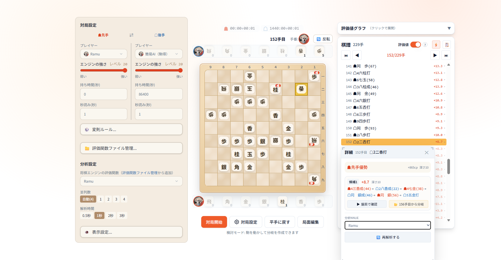
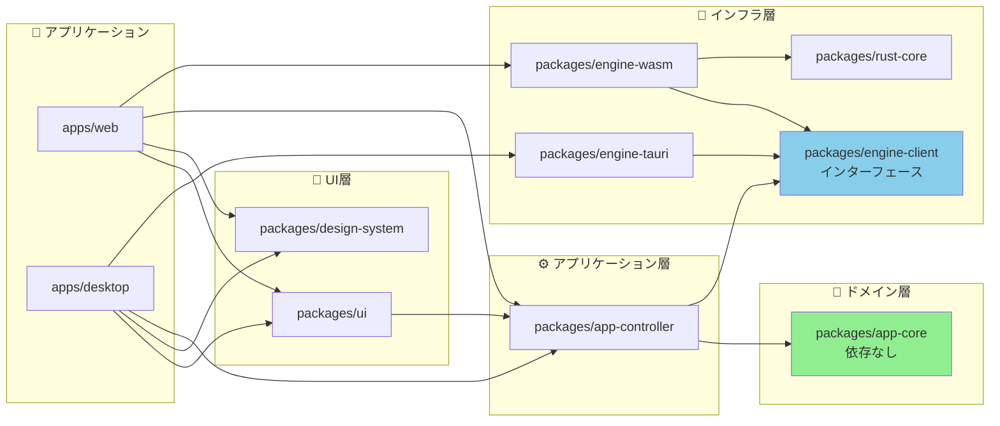

# ramu-shogi

Web・デスクトップ対応の将棋アプリです。[rshogi](https://github.com/SH11235/rshogi) エンジン（NNUE評価関数搭載）を使用しています。

🌐 **Web版**: https://ramu-shogi.sh11235.com/

<p align="center">
  
</p>

## 🚀 セットアップ

### 必要なツール

- **Rust**:
    ```bash
    $ rustup -V
    rustup 1.28.2 (e4f3ad6f8 2025-04-28)
    info: This is the version for the rustup toolchain manager, not the rustc compiler.
    info: The currently active `rustc` version is `rustc 1.93.0 (254b59607 2026-01-19)`
    ```
- **Node.js**: v24
- **pnpm**: パッケージマネージャー
- **wasm-bindgen-cli**: WASMビルド用（WebAssembly対応の場合）

### 開発環境のセットアップ

#### Windows環境での重要な設定

Windows環境で開発する場合、改行コードの自動変換を無効にする必要があります：

```bash
git config core.autocrlf false
```

**理由**：
- 本プロジェクトでは全てのテキストファイルでLF改行を使用しています（`.gitattributes`で設定済み）
- `core.autocrlf=true`の場合、`cargo fmt`実行時に改行コードの変換により、ファイル全体が変更されたように見える問題が発生します
- 特にpre-commitフックでの自動フォーマット時に予期しない変更が発生する可能性があります

### WASMビルドの準備

WebAssemblyビルドを実行する場合は、以下の設定が必要です：

```bash
# Rustのデフォルトツールチェーンを設定
rustup default stable

# WASMターゲットを追加
rustup target add wasm32-unknown-unknown

# wasm-bindgen-cliをインストール
cargo install wasm-bindgen-cli
```

## 📦 パッケージ構成

### パッケージ一覧

```
packages/
├── rust-core/              # Rust ワークスペース
│   └── crates/
│       └── engine-wasm/    # WASM バインディング（rshogi-core を使用）
├── app-core/               # ドメイン層：局面/棋譜処理、NNUEなど（依存なし）
├── app-controller/         # アプリケーション層：エンジン制御、状態管理
├── design-system/          # テーマ/トークン/Provider
├── ui/                     # 共通 UI コンポーネント
├── engine-client/          # EngineClient インターフェース定義
├── engine-wasm/            # Web/Wasm エンジン実装（Worker 経由）
└── engine-tauri/           # Tauri IPC エンジン実装

apps/
├── web/                    # Web アプリケーション
└── desktop/                # Tauri デスクトップアプリ
```

### パッケージ依存グラフ




【依存関係のポイント】
✓ app-core: 依存なし（純粋なドメインロジック）
✓ app-controller: app-core と engine-client のみに依存
✓ engine-*: engine-client インターフェースを実装
✓ 循環依存なし、単方向の依存フロー

エンジンコア実装は [rshogi](https://github.com/SH11235/rshogi) リポジトリで管理されています。

## 📄 ライセンス

GPL-3.0-or-later License

エンジンコア ([rshogi](https://github.com/SH11235/rshogi)) も GPL-3.0-or-later でライセンスされています。
